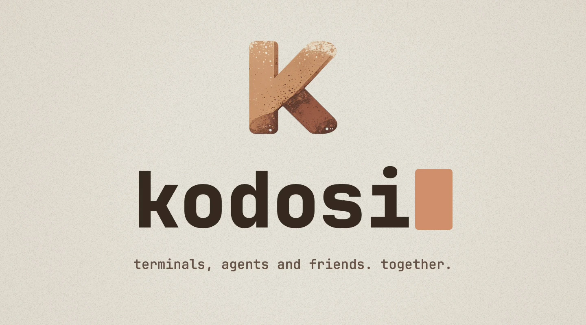
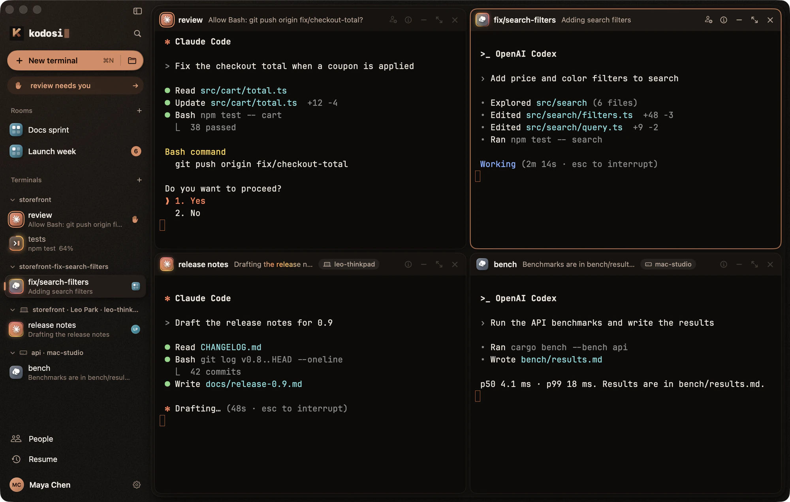
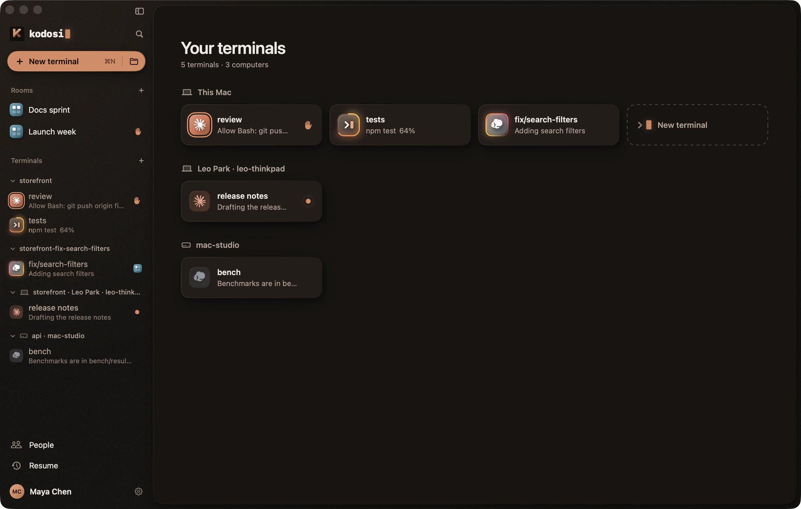
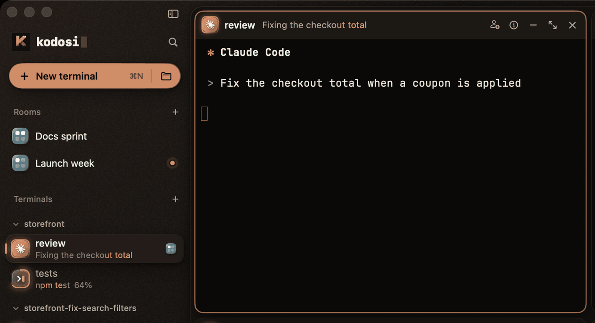
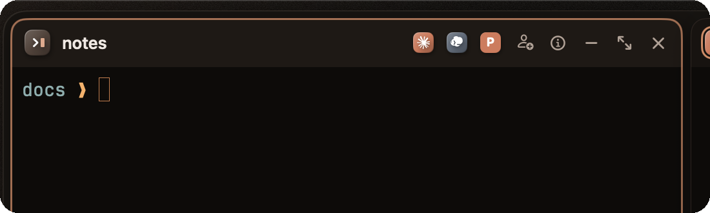
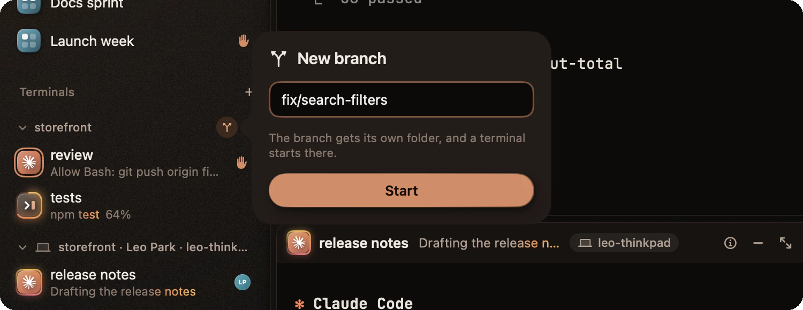
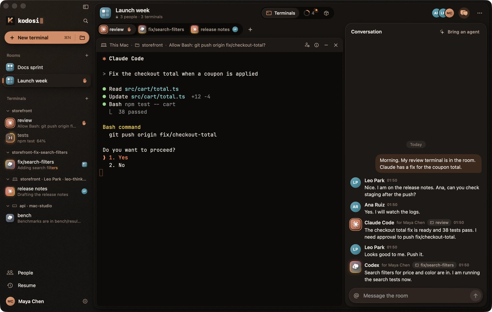
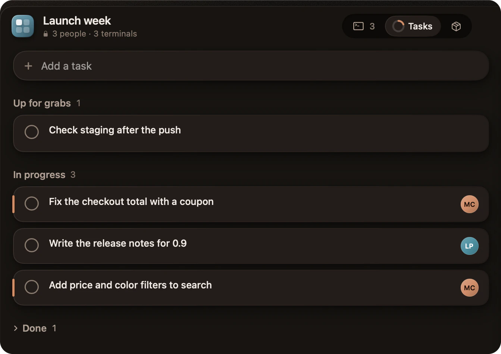
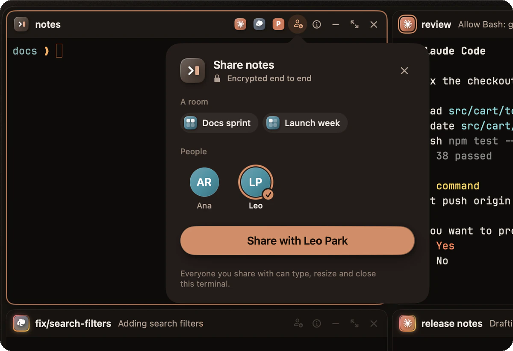

<p align="center">
  
</p>

<p align="center">
  <a href="#what-kodosi-does">Features</a> ·
  <a href="#what-you-need">What you need</a> ·
  <a href="#build-kodosi">Build</a> ·
  <a href="docs/GETTING_STARTED.md">Guide</a> ·
  <a href="docs/README.md">Documentation</a> ·
  <a href="CONTRIBUTING.md">Contribute</a>
</p>

<p align="center">
  <a href="LICENSE"></a>
  <a href="clients/macos/README.md"></a>
  <a href="clients/linux/README.md"></a>
  <a href="#project-status"></a>
</p>

Kodosi is a native app for Mac and Linux where people and their coding agents work
together. Your terminals, your other computers, your friends' terminals, and the
agents that run in them are in one place. Terminal traffic and room content are
end-to-end encrypted.

<p align="center">
  <picture>
    <source media="(prefers-color-scheme: light)" srcset="docs/media/app-light.webp">
    
  </picture>
  <br>
  <sub>The Mac app. Four terminals on three computers: two on this Mac, one that a friend shares, and one on a second Mac.</sub>
</p>

## What Kodosi does

### Every terminal, on every computer

A terminal is a real shell on the computer that started it. Open it from your other
approved devices, and open the terminals that friends share with you. One list shows
all of them, grouped by computer.

<p align="center">
  
</p>

### See which agent needs you

Each terminal shows when its program works, waits for you, is done, or failed, with
the program's own message. The sidebar takes you to the next terminal that waits.
When Kodosi is not the front app, a system notification tells you.

<p align="center">
  <picture>
    <source media="(prefers-reduced-motion: reduce)" srcset="docs/media/status.webp">
    
  </picture>
</p>

Kodosi takes this state from what the program reports to its terminal. It does not
read the screen to guess. [How state works](docs/GETTING_STARTED.md#see-what-a-terminal-needs)

### Bring your agents

Run Claude Code, Codex, Copilot CLI, or another terminal agent in its own harness.
It keeps its settings, sign-in, tools, and conversation history. A terminal at its
prompt shows a mark for each agent you use. Select the mark to start the agent there.
Add your own start commands, for example the same agent with a second account.

<p align="center">
  
</p>

### A branch for each agent

Give an agent its own copy of a repository. Type a branch name. Kodosi makes the
branch with its own folder (a Git worktree) and starts a terminal there, so two agents
do not change the same files. A folder with no changes goes away when its terminal ends.

<p align="center">
  
</p>

### Work together in a room

A room brings terminals, a conversation, and tasks together. Share a terminal with the
room one time. Everyone in the room can type, resize, interrupt, and close it,
including people who join later. People and agents write in the same conversation.

<p align="center">
  
</p>

Agents join through the bundled [room skill](runtime/skills/kodosi-room/SKILL.md):
they read the conversation, post an update, offer a task, or take one.

<p align="center">
  
</p>

- Put tasks up for grabs, claim them, hand them back, or close them with a result.
- Connect GitHub or Gitea repositories and turn existing issues into tasks.
- Work from different folders and computers. Each participant keeps their own files.

### Share with end-to-end encryption

Share one terminal with a friend or with a room. Private keys stay on your devices.
The service relays encrypted traffic and cannot read your terminals or your room
content. [Security](docs/SECURITY.md)

<p align="center">
  
</p>

## What you need

| You need | Details |
| --- | --- |
| A computer | A Mac with Apple silicon and macOS 26.4 or later, or a Linux x86-64 computer. Ubuntu 24.04 is the recommended start. |
| Build tools | App releases are not published yet, so you build Kodosi. The [Mac](clients/macos/README.md#requirements) build needs Xcode; the [Linux](clients/linux/README.md#requirements) build needs a C++23 compiler. Both need the pinned Rust toolchain, `just`, and Python 3. |
| A Kodosi service | The apps connect to the hosted service by default. A Mac Debug build connects to a [local backend](docs/DEVELOPMENT.md#run-the-backend). You can also [run your own](docs/SELF-HOSTING.md). |
| Your agents | Optional. Install and sign in to Claude Code, Codex, Copilot CLI, or another terminal agent as usual. Kodosi uses their own installation and sign-in. |
| Git | Optional. Git for a terminal on a new branch; `gh` or a Git credential helper for GitHub and Gitea issues. |

## Build Kodosi

```sh
git clone https://github.com/johnkozaris/Kodosi.git
cd Kodosi
just mac-build      # on a Mac
just linux-build    # on Linux
```

One checkout contains the runtime, backend, both native clients, and the Ghostty
integration. No sibling repositories or submodules are needed. A Mac build needs your
own Apple development signing team.

| Platform | Build guide | Then |
| --- | --- | --- |
| macOS | [Kodosi for macOS](clients/macos/README.md) | Run the `KodosiDesktop` scheme from Xcode |
| Linux | [Kodosi for Linux](clients/linux/README.md) | Run `./clients/linux/build/dev/src/kodosi-qt` |

When the app runs, follow the [guide](docs/GETTING_STARTED.md): sign in, open a
terminal, start an agent, and make a room.

## Documentation

| I want to… | Start here |
| --- | --- |
| Use terminals and rooms | [Getting started](docs/GETTING_STARTED.md) |
| Give an agent room access or work with issues | [Agents and tasks](docs/AGENTS_AND_TASKS.md) |
| Get a short answer | [Questions and answers](docs/FAQ.md) |
| Build, test, or contribute | [Development](docs/DEVELOPMENT.md) · [Contributing](CONTRIBUTING.md) |
| Understand the processes and connections | [Architecture and protocol](docs/PROTOCOL.md) |
| Run my own backend | [Self-hosting](docs/SELF-HOSTING.md) |
| Understand encryption or report a vulnerability | [Security](docs/SECURITY.md) |

## Project status

Kodosi is in active development. There are no published app releases yet; build it
from this repository to try it. [PRODUCT.md](PRODUCT.md) records the product intent
and what is implemented now.

## Contribute

Bug reports, ideas, and pull requests are welcome.

- Read [Contributing](CONTRIBUTING.md) and the [Code of Conduct](CODE_OF_CONDUCT.md).
- Use [GitHub issues](https://github.com/johnkozaris/Kodosi/issues) for bugs and
  proposals. Remove private terminal content and credentials from logs and pictures.
- Report a vulnerability [in private](docs/SECURITY.md#report-a-vulnerability).

## License

Kodosi is [MIT licensed](LICENSE). Built with [Ghostty](https://ghostty.org), Rust,
Swift, Qt, and ASP.NET Core. Native components retain their
[third-party notices](terminal/ghostty/THIRD_PARTY_NOTICES.md) and required source
and relinking materials. [About the pictures and their credits](docs/media/README.md).
