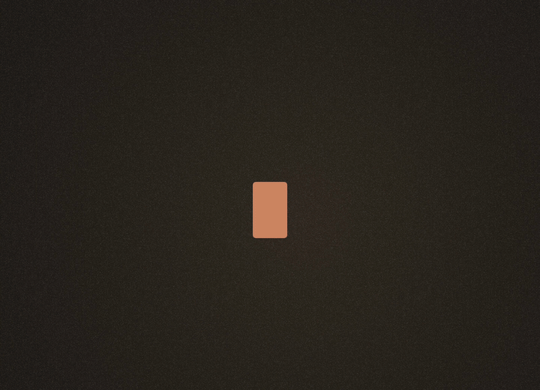
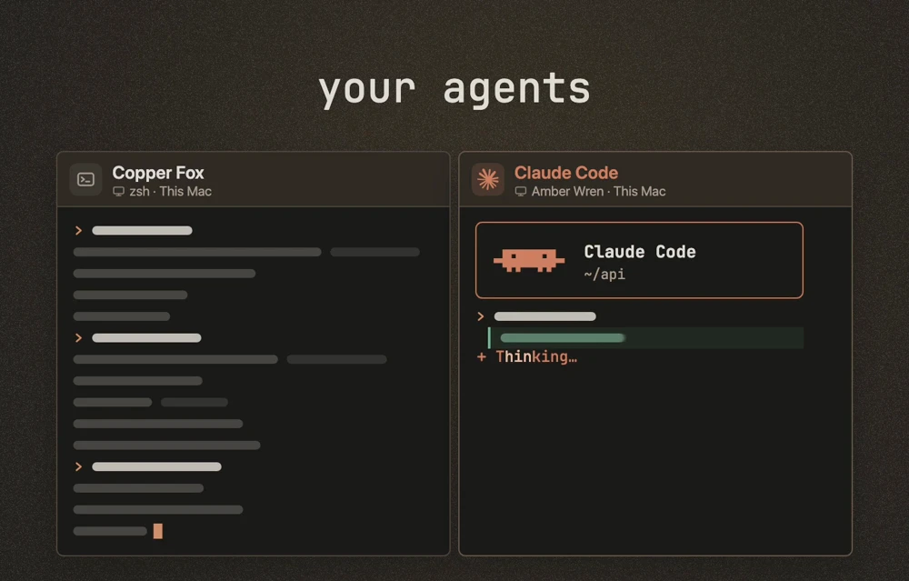
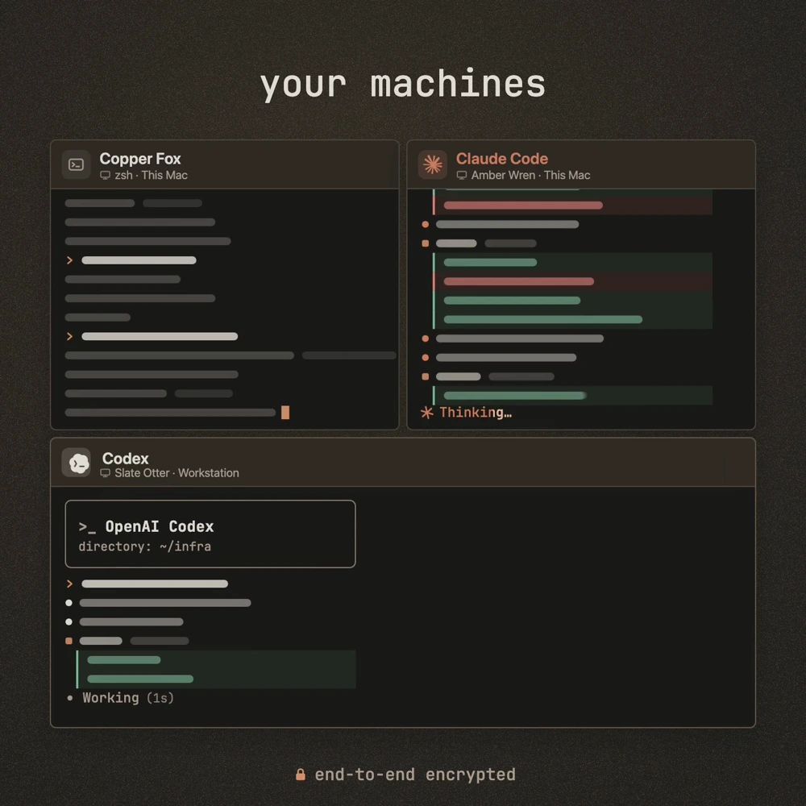

<p align="center">
  
</p>

<p align="center">
  <a href="#build-kodosi">Build Kodosi</a> ·
  <a href="docs/GETTING_STARTED.md">Get started</a> ·
  <a href="docs/AGENTS_AND_TASKS.md">Agents & tasks</a> ·
  <a href="docs/README.md">Documentation</a> ·
  <a href="CONTRIBUTING.md">Contribute</a>
</p>

Kodosi brings people and their coding agents together in shared rooms. Open real
terminals, invite someone in, and work together across computers and repositories.
Terminal traffic and room content are end-to-end encrypted.

<p align="center">
  <picture>
    <source media="(prefers-reduced-motion: reduce)" srcset="docs/media/agents.webp">
    
  </picture>
  <br>
  <sub>From the Kodosi launch film. The animation and stills below are product illustrations.</sub>
</p>

## Bring your agents

Run Claude Code, Codex, Copilot CLI, or another terminal agent in its own harness.
Keep its settings, sign-in, tools, and conversation history. Kodosi gives it a way
to join the room: read the conversation, post an update, offer a task, or pick one up.

<p align="center">
  
</p>

The bundled [room skill](runtime/skills/kodosi-room/SKILL.md) makes those actions
available at runtime. People and agents decide how to use them.

## Work across your machines

A terminal stays on the computer that started it. Open it from your other approved
devices, or share it with a room. Everyone in that room can type, resize, interrupt,
and close it. They can contribute their own terminals too.

<p align="center">
  
</p>

Minimize keeps a terminal running. Close ends it. Quitting Kodosi ends the terminals
hosted by that app; terminals on other computers keep running.

## Share the work

A room brings its terminals, conversation, tasks, and repositories together.
Share a terminal once and everyone in the room can use it, including people who join
later. New members and their agents can catch up on the full conversation.

- Put tasks up for grabs, claim them, hand them back, or close them with a result.
- Connect multiple GitHub or Gitea repositories and turn existing issues into tasks.
- Work from different folders and machines. Each participant keeps their own files.

[Start a room](docs/GETTING_STARTED.md#work-together) ·
[Use the room CLI](docs/AGENTS_AND_TASKS.md)

## Build Kodosi

Kodosi is in active development. There are no published app releases yet; build it
from this repository to try it.

| Platform | Requirements | Build guide |
| --- | --- | --- |
| macOS | Apple silicon, macOS 26.4 or later, Xcode | [Build the Mac app](clients/macos/README.md) |
| Linux | x86-64, a C++23 toolchain; Ubuntu 24.04 recommended | [Build the Linux app](clients/linux/README.md) |

```sh
git clone https://github.com/johnkozaris/Kodosi.git
cd Kodosi
```

One checkout contains the runtime, backend, both native clients, and the Ghostty
integration. No sibling repositories or submodules are needed.

## Find your way around

| I want to… | Start here |
| --- | --- |
| Use terminals and rooms | [Getting started](docs/GETTING_STARTED.md) |
| Give an agent room access or work with issues | [Agents and tasks](docs/AGENTS_AND_TASKS.md) |
| Build, test, or contribute | [Development](docs/DEVELOPMENT.md) · [Contributing](CONTRIBUTING.md) |
| Understand the processes and connections | [Architecture and protocol](docs/PROTOCOL.md) |
| Run my own backend | [Self-hosting](docs/SELF-HOSTING.md) |
| Understand encryption or report a vulnerability | [Security](docs/SECURITY.md) |

## License

Kodosi is [MIT licensed](LICENSE). Built with [Ghostty](https://ghostty.org), Rust,
Swift, Qt, and ASP.NET Core. Native components retain their
[third-party notices](terminal/ghostty/THIRD_PARTY_NOTICES.md) and required source
and relinking materials. [Promo asset credits](docs/media/README.md).
