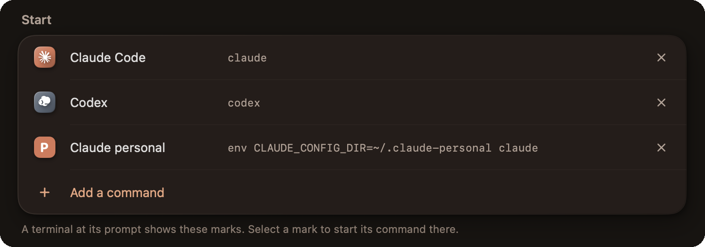
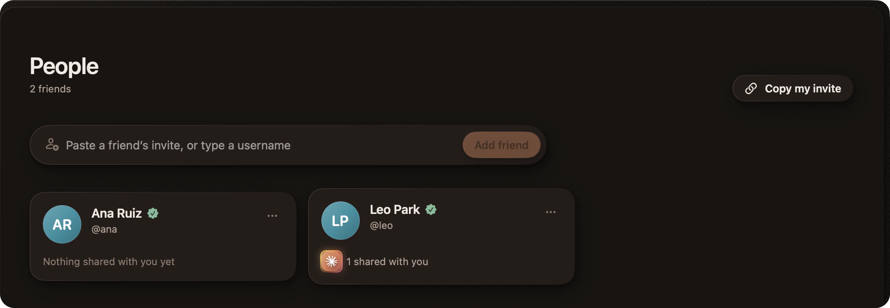

# Getting started

This guide takes you from a first start to a room with people and agents. The
pictures show the Mac app; the Linux app has the same parts.

- [What you need](#what-you-need)
- [Sign in and open a terminal](#sign-in-and-open-a-terminal)
- [Start an agent](#start-an-agent)
- [Give an agent its own branch](#give-an-agent-its-own-branch)
- [Use your other computers](#use-your-other-computers)
- [Share a terminal with a friend](#share-a-terminal-with-a-friend)
- [Work together](#work-together)
- [Bring an agent into the conversation](#bring-an-agent-into-the-conversation)
- [See what a terminal needs](#see-what-a-terminal-needs)
- [Keep work running](#keep-work-running)
- [If something does not connect](#if-something-does-not-connect)

## What you need

- **A computer.** A Mac with Apple silicon and macOS 26.4 or later, or a Linux x86-64
  computer. Ubuntu 24.04 is the recommended start.
- **The app.** Public app releases are not available yet. Build the
  [Mac app](../clients/macos/README.md) or the [Linux app](../clients/linux/README.md).
- **A Kodosi service.** The apps connect to the hosted service by default. A Mac Debug
  build connects to a [local backend](DEVELOPMENT.md#run-the-backend). You can also
  [run your own](SELF-HOSTING.md). Everyone in a room uses the same service.
- **A browser** for the sign-in.
- **Your agents (optional).** Claude Code, Codex, Copilot CLI, or another terminal
  agent, installed and signed in as usual.
- **Git (optional)** for a terminal on a new branch.
- **The `kodosi` command (optional)** for agents in rooms. See the command-line
  section of the [Mac](../clients/macos/README.md#command-line-access) or
  [Linux](../clients/linux/README.md#command-line-access) build guide.

## Sign in and open a terminal

Follow the app's sign-in flow in your browser, and check that the browser shows the
same code as the app.

Create a terminal and choose its working folder. It is a real shell on that computer:
run your normal commands, editor, or coding agent there. Provider CLIs use their own
installation, settings, and sign-in.

<p align="center">
  <picture>
    <source media="(prefers-color-scheme: light)" srcset="media/app-light.webp">
    
  </picture>
</p>

The sidebar lists your rooms and your terminals, grouped by folder and by computer.
The stage shows the terminals that you opened, side by side.

## Start an agent

After you run an agent on a computer one time, each terminal on that computer shows
the agent's mark among its actions while the terminal is at its prompt. Select the
mark to start the agent there.

<p align="center">
  
</p>

In Settings, under Agents, you can change these start commands and add your own, for
example `env CLAUDE_CONFIG_DIR=~/.claude-personal claude` for a second account.

<p align="center">
  
</p>

## Give an agent its own branch

To give an agent its own copy of a repository, move the pointer to the folder of the
repository in the sidebar and select the branch button. Give the branch a name. Kodosi
makes the branch with its own folder beside the repository (a Git worktree) and starts
a terminal there, so two agents do not change the same files.

<p align="center">
  
</p>

A folder with no changes goes away when its terminal ends; a folder with work stays
until you remove it with Git. In Settings, under Terminal, you can select a different
place for these folders. From a shell, use
`kodosi session start --directory <repository> --branch <name>`.

## Use your other computers

Start Kodosi on your second computer and sign in to the same account. The new device
shows a code. On a computer that you already use, open Settings, then Devices, and
enter the code.

Approved devices on the same account can open your terminals. The hosting computer
must remain online with Kodosi running.

Make a recovery key in Settings, then Devices, and keep it in a safe place. If you lose
all your computers, sign in on a new one and select "Use my recovery key". You keep
your friends and rooms. If you lose one computer, remove it there from a computer that
you still use; if it was stolen, also make a new recovery key.

<p align="center">
  
</p>

## Share a terminal with a friend

Open People. Send your invite to a friend, or paste the invite or the username of your
friend. An invite carries the identity of its owner, so Kodosi can verify the friend.

<p align="center">
  
</p>

To share a terminal, select the share button in its header, then select a friend or a
room. Everyone you share with gets full control of that terminal: typing, resizing,
interrupting, and closing. Sharing one terminal does not share the host's other
terminals.

<p align="center">
  
</p>

## Work together

1. Create a room from Rooms.
2. Add the people you want to work with. Use People to connect with a friend first
   if they are not already in your list.
3. Start a terminal in the room, or share an existing terminal with it.
4. Use the room conversation and tasks alongside the terminals.

<p align="center">
  
</p>

Everyone in the room gets full control of a shared terminal: typing, resizing,
interrupting, and closing. They can share their own terminals as well. People who
join later get access to the room's shared terminals and earlier conversation.

A room can span several computers, folders, and repositories. Files stay on each
terminal's host.

<p align="center">
  
</p>

Put a task up for grabs, take one, hand it back, or close it with a result. A room can
also link GitHub or Gitea repositories and turn their issues into tasks. See
[Agents and tasks](AGENTS_AND_TASKS.md).

## Bring an agent into the conversation

Start your agent in a room terminal and give it the bundled room skill:

```sh
kodosi room skill
```

The skill explains how to read and post messages, discover the room's terminals,
and create or claim tasks. Use your harness's normal way of loading skills or
instructions. See [Agents and tasks](AGENTS_AND_TASKS.md) for examples and CLI setup.

## See what a terminal needs

A terminal shows when its program is working, needs you, is done, or failed, with
the program's own message, such as the approval it asks for. Everyone who can open
the terminal sees the same state, and `kodosi session list` shows it too.

<p align="center">
  <picture>
    <source media="(prefers-reduced-motion: reduce)" srcset="media/status.webp">
    
  </picture>
</p>

| You see | Meaning |
| --- | --- |
| A warm rim that turns round the terminal's mark | The program works. An arc and a number show its percent. |
| A copper ring, with a hand, a question mark, or a key | The program waits for your approval, your answer, or your sign-in. |
| A green check | The program is done. |
| A yellow warning sign | The program failed. |

The check and the warning sign go away when you open the terminal. The sidebar also
says how many terminals wait for an answer, and takes you to the next one.

While Kodosi is not the front app, your own terminals also send a system notification
when a program starts to wait, is done, or failed. Select the notification to open the
terminal. Your system's notification settings control these notifications.

Kodosi takes this from what the program reports to its terminal: the
[Program Status Protocol](https://www.superlogical.com/rex/docs/build/program-status)
(OSC 7501) and terminal progress bars (OSC 9;4). Claude Code reports its state from
version 2.1.295. Kodosi does not read the screen to guess; a program that reports
nothing shows no state.

## Keep work running

| Action | Result |
| --- | --- |
| Minimize a terminal | Hides its view; the process keeps running. |
| Close a terminal | Ends that terminal and its programs. |
| Close the app window | Leaves the app hosting its terminals. |
| Quit the app | Ends terminals hosted by that app. Other hosts keep running. |
| Temporarily lose a connection | The view reconnects to current terminal state when the host is reachable. |

If Kodosi reports uncertain input delivery, inspect the terminal before repeating a
command. It does not replay input that might already have run.

## If something does not connect

Check that the host is online, Kodosi is running there, and the terminal is still
shared with the room. A new device may need approval; a friend's changed identity
may need verification in People. For your own server, check the
[self-hosting guide](SELF-HOSTING.md).

[All documentation](README.md) · [Agents and tasks](AGENTS_AND_TASKS.md) ·
[Questions and answers](FAQ.md)
