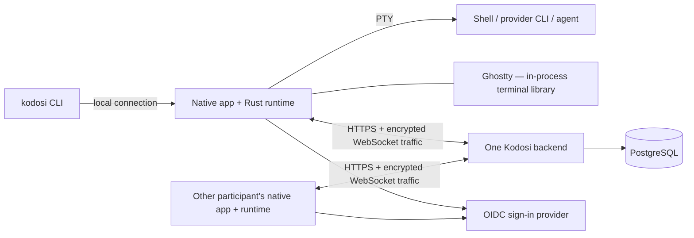

# Architecture and protocol

Kodosi has native desktop hosts and one serving backend. Terminals and agents run
on participant computers. The backend stores shared metadata and encrypted room
records and relays encrypted terminal connections.

## What starts what

The Mac app embeds the Rust runtime through its native API. The Qt app does the same.
The runtime starts a local shell on a PTY; that shell can start an existing agent CLI.
Ghostty is a linked library for terminal state/rendering, not a separate process host.
Native views handle presentation, focus, input, and accessibility.

The `kodosi` CLI connects to the running local host. If none is running, it can
start its own background runtime host; `kodosi host` runs one in the foreground.
It exposes terminal, account, and room actions without starting an ASP.NET backend
or taking over provider execution.
On macOS, the signed app executable also serves the CLI so it uses the same Keychain
identity. Linux packages include the native app and runtime CLI integration.

## Terminal state and concurrency

The hosting runtime owns each live process, terminal state, and output order. Each
remote viewer receives a current checkpoint followed by ordered updates. Viewers have
independent encrypted channels and flow control; a slow or disconnected viewer does
not become an unbounded output archive.

Several admitted participants can use one terminal. Their input reaches the host's
single terminal process. Kodosi does not arbitrate file edits between people or agents;
each tool continues to operate on its host's files. Terminal sharing follows room
membership, while sharing one terminal leaves other local terminals alone.

Reconnecting restores current state. Input whose delivery is uncertain is not replayed,
and a stale view cannot control a replacement terminal. Minimize dismisses a view;
Close ends its process; quitting a host ends its local terminals.

## Backend and room data

ASP.NET Core serves HTTP metadata APIs and WebSocket connections. One serving process
holds live device sessions and relay routing, backed by a PostgreSQL lease. A backend
restart causes clients to renew sessions and reconnect. Durable records live in
PostgreSQL; the relay is not a durable terminal input queue.

Room conversation, tasks, and repository links are encrypted and signed at endpoints.
The backend assigns sequence/version metadata and stores ciphertext. Signed room key
history distributes keys to member devices and preserves earlier history for later
joiners. See [Security](SECURITY.md) for cryptography and visible metadata.

Repository issue actions run from the participant's runtime using local provider
credentials. The Git provider remains authoritative for a linked issue. Room tools
give agents context and actions; providers retain agent execution and native history.

## Contract authorities

Use the generated files for current versions and message definitions:

| Contract | Authority |
| --- | --- |
| Native desktop commands and events | [desktop-runtime.json](../protocol/desktop-runtime.json) |
| Backend HTTP and device control | [backend-api.json](../protocol/backend-api.json) |
| Terminal connections and framing | [terminal-connections.json](../protocol/terminal-connections.json) |
| C ABI | [Native header](../clients/macos/Frameworks/KodosiKit.xcframework/Headers/kodosi_runtime.h) |
| Upstream terminal revisions and artifacts | [Ghostty.lock](../Ghostty.lock) |

Rust generates shared contracts. Use `just protocol-gen` for an intentional change and
`just protocol-check` to verify committed output. Keep clients, backend, and runtime
aligned in the same change; do not maintain parallel historical protocol documents.

## Source map

- [runtime/src](../runtime/src/): sessions, identity, transport, rooms, providers, and CLI.
- [backend/src/Kodosi.Host](../backend/src/Kodosi.Host/): accounts, devices, friends,
  missions, sessions, and terminal connections. Internal APIs call rooms “missions.”
- [clients/macos](../clients/macos/) and [clients/linux](../clients/linux/): native UI.
- [terminal/ghostty](../terminal/ghostty/): terminal integration and native artifacts.

[All documentation](README.md) · [Development](DEVELOPMENT.md)
